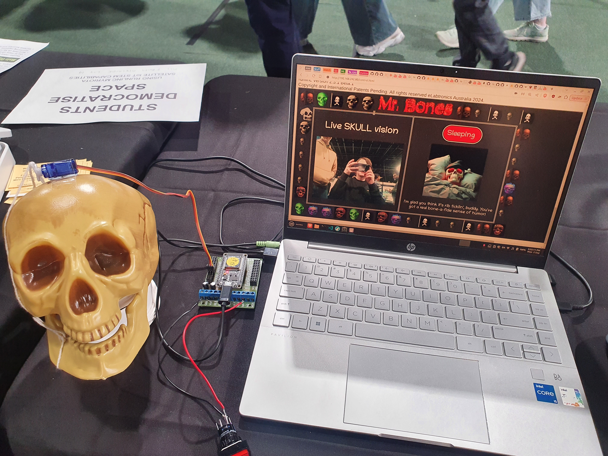

# Talking Skull!
Meet Mr. Bones, a talking skull with a terrible sense of humor who never seems to stop making terrible bone puns! This is my entry into the 2024 Royal Adelaide Show STEM competition. It is a skull with an actuatable jaw that uses OpenAI's Whisper to transcribe speech, Microsoft's Florence 2 to caption my webcam, Google's Gemma-2 2B to generate text, and runlinc to control the speech button and actuate the jaw of the skull!

## Structure
This project is separated into 3 different parts that all communicate through one-another:

1. runlinc
    - This is the interface for the skull; what the user sees and the skull's jaw itself
    - Has a button and servo hooked up for their respective functions
    - Uses websockets to connect to and communicate with:
2. Mr. Bones
    - [Inspiration](https://www.youtube.com/watch?v=O32D2ool2nY), [here](https://www.youtube.com/watch?v=AylSEBh8dj4)
    - The websockets server dictating communication between runlinc and beyond!
    - Is in charge of the recording of microphone audio and bridging the gap between the runlinc and AI models
    - Takes in the user's inputs and sends them off to:
3. Galactus!
    - [Inspiration](https://www.youtube.com/watch?v=y8OnoxKotPQ)
    - The orchestrator server that orchestrates the connections and flow between the different AI models
    - This part is designed to be very portable, in fact I initially wanted it running on my home PC (with CUDA acceleration) being tunnled through ngrok so I'd get super fast speeds
    - Communicates only through a single HTTP route that takes in the audio and webcam image, and returns the generated text

## Project Setup
Thankfully the setup is pretty easy for this project: 

1. Pip install the requirements.txt files in the Galactus and MrBones directories to install their requirements
2. Install fastapi
3. Run the install-models.sh script in Galactus to install the AI models

Note that due to using 3 separate AI models running on a CPU with 16gb of RAM, the generation speeds for me were quite slow even with only a 2B model at 512 tokens of context. You'll need a modern CPU and 16gb of RAM if you want to run this without a GPU, otherwise with a GPU you can split off some or all of the models to your GPU for significantly faster speeds.

## Running the Project
Due to the number of individual components in this project, this part is slightly maybe more involved than the setup. The steps for this are:

1. In the Galactus/servers/ directory, run llm.sh, stt.sh and img.sh in separate terminals. This opens 3 servers for the 3 different AI models.
2. Now back in the root of the project, run Galactus in another terminal with the command `fastapi run Galactus/galactus.py --port 8315`
3. And finally to run MrBones, run `py mrbones.py` in the MrBones directory in yet another terminal

Now simply open your runlinc board and open `runlinc/eyesnears.json`, making sure to connect your servo to Pin 25 and your button to Pin 4, setting their configurations as SERVO and DIGITAL_IN respectively. 

I will note that my button I used was not one built for runlinc, so I had to wire it between the 12V and io2 ports with a 2k resistor going between io2 and GND. Also due to the way I mounted the servo on the skull (Blu Tack on the top) I had to limit the servo to only 60 degrees max or else it would push itself off the skull itself lol.

## Inspiration
This project comes from a lot of places converging into one. I'll list as many of them as I can remember:

- All of the LLM knowledge I've gathered over the last year and a half is solely from the amazing [r/localllama](https://new.reddit.com/r/LocalLLaMA/) subreddit
- The name MrBones comes from the famous [Mr. Bones' Wild Ride meme](https://knowyourmeme.com/memes/mr-bones-wild-ride) which I learned about from Vargskelethor Joel's old (but so great) Rollercoaster Tycoon videos I watched as a kid, found [here](https://www.youtube.com/watch?v=O32D2ool2nY) and [here](https://www.youtube.com/watch?v=AylSEBh8dj4)
- The name Galactus for the AI orchestrator comes from KRAZAM's wonderful video [Microservices](https://www.youtube.com/watch?v=y8OnoxKotPQ)
- The general vibe of a goofy skull comes from the [Green Skull](https://www.youtube.com/watch?v=K2ZhbUpFG_w) bit in CallMeCarson's [Weird People in Discord 2](https://www.youtube.com/watch?v=au0mRNOS3pE) video
- The idea of a skull making bad jokes is of course from [Sans the Skeleton](https://undertale.fandom.com/wiki/Sans) from the 2015 indie game [Undertale](https://undertale.com/)
- The idea of the skull in general just making jokes also comes from the [Summerween](https://www.youtube.com/watch?v=-SNEwiG98SM) episode of Gravity Falls, where there is [a skull that makes jokes when pressed down](https://www.youtube.com/watch?v=dxQ2niokNIk)

## AI Notice
This project obviously uses generative AI, so it has it's ethical dillemas and I'd just like to cite the models I've used here as well as the uses of gen AI in my project. 

**LLM:** [Gemma-2 2B it](https://huggingface.co/bartowski/gemma-2-2b-it-GGUF), running the Q4_K_M GGUF quantization by Bartowski, running through [llama.cpp](https://github.com/ggerganov/llama.cpp)'s [server](https://github.com/ggerganov/llama.cpp/tree/master/examples/server) example

**STT:** [Whisper tiny.en](https://huggingface.co/ggerganov/whisper.cpp), running the full precision GGML model through [whisper.cpp](https://github.com/ggerganov/whisper.cpp)'s [server](https://github.com/ggerganov/whisper.cpp/tree/master/examples/server) example

**IMG:** [Florence-2 Base](https://huggingface.co/microsoft/Florence-2-base), running my own modified version of it's example code as a FastAPI server for more detailed image captioning

**Skeleton States:** The images used for the current state of the skeleton were all generated using the [FLUX.1 Schnell](https://huggingface.co/black-forest-labs/FLUX.1-schnell) model

**I am not claiming ownership over any of the outputs nor AI generated images used in this project, it belongs to (legally I think) the devs of the model and (in my humble opinion) the artists and such who's work was yoinked to create these models without permission**